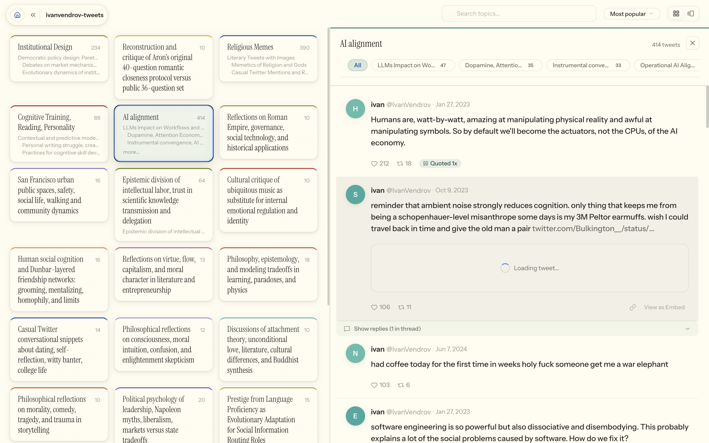

# tweetscope

**Turn your Twitter/X archive into a searchable, visual knowledge base.**

Drop in your archive zip. Tweetscope embeds every tweet, maps them onto a 2D scatter plot, clusters them by topic, and labels each cluster with an LLM — so you can browse years of tweets by theme instead of scrolling chronologically.

<picture>
  
</picture>

## Features

### Browse by topic

Navigate a hierarchical topic tree. Click any topic to filter the scatter plot and see matching tweets in the feed. Drill down from broad themes to fine subtopics.

<picture>
  
</picture>

### Multi-column carousel

Expand the sidebar into a full-width carousel — one column per subtopic, with engagement metrics, quote embeds, and thread chains side by side.

<picture>
  
</picture>

### Semantic and keyword search

Search your tweets by meaning (vector nearest-neighbor via VoyageAI) or by keyword (full-text search), with matching points highlighted live on the scatter plot.

## How it works

Your tweets flow through a six-step ML pipeline: **ingest → embed → UMAP → cluster → label → explore**. Each step writes reproducible artifacts (Parquet, HDF5, JSON). You can re-run any step with different parameters and compare results via scopes.

<picture>
  
</picture>

## Getting started

### Prerequisites

- Python 3.11+ and [uv](https://docs.astral.sh/uv/)
- Node.js 22+ and npm
- API keys: [VoyageAI](https://dash.voyageai.com/) (embeddings) and [OpenAI](https://platform.openai.com/) (cluster labeling)
- A Twitter/X archive zip (request yours at https://x.com/settings/download_your_data)

### 1. Clone and install

```bash
git clone --recurse-submodules <repo-url>
cd latent-scope

# Python pipeline
uv pip install -e .

# API + frontend
cd api && npm install && cd ..
cd web && npm install && cd ..
```

### 2. Configure

```bash
cp .env.example .env
cp api/.env.example api/.env
```

Edit `.env` — set your data directory and API keys:
```
LATENT_SCOPE_DATA=~/latent-scope-data
VOYAGE_API_KEY=your-key
OPENAI_API_KEY=your-key
LATENT_SCOPE_APP_MODE=studio
```

Edit `api/.env` — set the same data directory and keys:
```
LATENT_SCOPE_DATA=~/latent-scope-data
LATENT_SCOPE_APP_MODE=studio
VOYAGE_API_KEY=your-key
PORT=3000
```

### 3. Import your Twitter archive

```bash
# Place your archive in archives/ (gitignored)
cp ~/Downloads/twitter-archive.zip archives/

# Import and run the full pipeline (embed → UMAP → cluster → label → scope)
uv run python3 -m latentscope.scripts.twitter_import my-tweets \
  --source zip --zip_path archives/twitter-archive.zip --run_pipeline
```

### 4. Explore

```bash
# Terminal 1: start the API
cd api && npm run dev

# Terminal 2: start the frontend
cd web && npm run dev
```

Open http://localhost:5174 — select your dataset and scope to explore.

### Large archives

For archives with 100k+ tweets, you can import year by year to keep memory manageable, then run the pipeline once on the full dataset. See [Progressive import](DEVELOPMENT.md#progressive-import-for-large-archives) in the development guide.

## Development

See [DEVELOPMENT.md](DEVELOPMENT.md) for:

- Architecture overview and runtime modes
- Repository structure
- Python pipeline reference (CLI, scripts, data contracts)
- Hono API routes and adding new endpoints
- Frontend contexts, hooks, and styling rules
- Dataset directory structure and data contracts
- Deployment guide (Vercel + Cloudflare R2)

## Contributing

```bash
# Clone with submodules
git clone --recurse-submodules <repo-url>
# or after clone:
git submodule update --init --recursive
```

See [DEVELOPMENT.md](DEVELOPMENT.md) for architecture details and dev setup.
