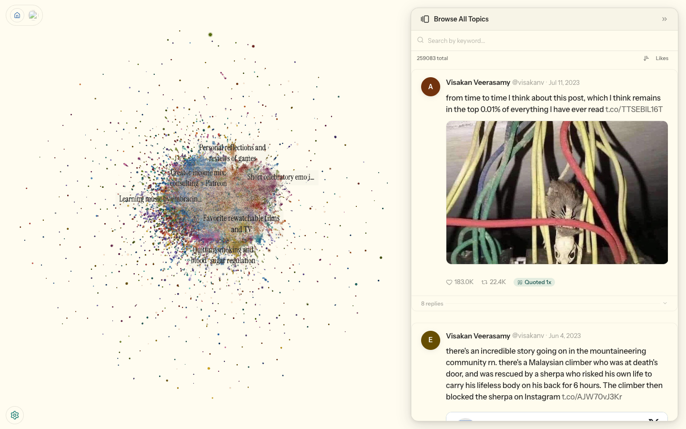
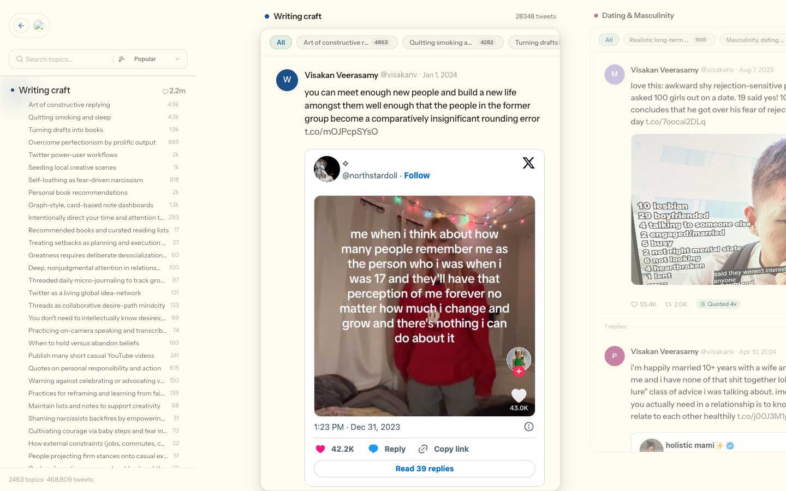

<p align="center">
  
</p>

# tweetscope

[Live demo →](https://tweetscope.maskys.com)

Turn a Twitter/X archive into a searchable map of themes, threads, and quotes.

Tweetscope imports an archive, enriches tweets with surrounding context, projects the corpus into an interactive space, names clusters with hierarchical labels, and serves the result through a React UI backed by a Hono API and LanceDB.

<picture>
  
</picture>

## What You Can Do

- Browse a topic map instead of scrolling a timeline.
- Search semantically and by keyword against the active scope.
- Open thread and quote side views with reply/quote graph overlays.
- Expand into a topic directory or multi-column carousel.
- Scrub time with timeline playback and filter to thread-heavy regions.
- Import likes into a sibling `-likes` dataset that is grouped with the main collection on the dashboard.

<picture>
  
</picture>

## Current Architecture

The frontend is a routed React/Vite app with three live screens: dashboard, new collection, and the main explore surface. It talks only to the TypeScript Hono API. The API reads catalog metadata and serving tables from LanceDB, proxies a small set of raw files, and spawns Python subprocesses for imports. The Python side materializes artifacts under `LATENT_SCOPE_DATA`, exports serving tables to LanceDB, and keeps the catalog in sync.

<picture>
  
</picture>

Diagram source: `documentation/diagrams/system-architecture.mmd`

## Pipeline

The current default Twitter pipeline is no longer the old `ingest -> embed -> UMAP -> cluster -> label -> explore` path. Today it is:

1. Import and normalize archive data with `twitter_import.py`
2. Create contextual embeddings with `embed.py`
3. Build a 2D display UMAP and a separate clustering UMAP
4. Build a hierarchy with `build_hierarchy.py` (PLSCAN)
5. Name the hierarchy with `toponymy_labels.py`
6. Materialize a serving scope, validate the contract, export to LanceDB, and register it in the catalog
7. Build reply/quote graph artifacts for thread and quote views

<picture>
  
</picture>

Diagram source: `documentation/diagrams/pipeline-flow.mmd`

## Getting Started

### Prerequisites

- Python 3.11+
- `uv`
- Node.js 22+
- npm
- `VOYAGE_API_KEY`
- `OPENAI_API_KEY`
- A writable `LATENT_SCOPE_DATA` directory

Note: the repo root does not currently include a checked-in Python packaging manifest, so the commands below assume the Python dependencies are already available in your active environment.

### Install JavaScript dependencies

```bash
git clone --recurse-submodules https://github.com/maskys/tweetscope.git
cd latent-scope

cd api && npm install && cd ..
cd web && npm install && cd ..
```

### Configure the environment

```bash
cp .env.example .env
```

Set at least:

```bash
LATENT_SCOPE_DATA=~/latent-scope-data
LATENT_SCOPE_APP_MODE=studio
VOYAGE_API_KEY=your-key
OPENAI_API_KEY=your-key
PORT=3000
```

The API dev server reads the repo-root `.env` via `api/package.json`.

### Start the app

```bash
# Terminal 1
cd api && npm run dev

# Terminal 2
cd web && npm run dev
```

Open `http://localhost:5174`.

### Import data

> **How to request your X data export**
>
> 1. Go to [x.com/settings/download_your_data](https://x.com/settings/download_your_data)
> 2. Re-enter your password and request your archive
> 3. X will email you when it's ready (usually 24–48 hours)
> 4. Download the `.zip` — this is what you upload to Tweetscope

Preferred UI flow:

1. Open `/new`
2. Upload a native X archive zip or start a Community Archive import
3. For native archives, the browser extracts and normalizes the zip locally before upload
4. The API runs `latentscope.scripts.twitter_import` and redirects into the new scope when the job completes

**[Community Archive](https://communityarchive.org)** is an alternative if you don't have your own export. It pulls publicly donated tweet archives by username. Enter any username that has donated their archive and Tweetscope will fetch and process it. Community archives may not include likes.

Direct CLI flow:

```bash
uv run python3 -m latentscope.scripts.twitter_import my-tweets \
  --source zip \
  --zip_path archives/twitter-archive.zip \
  --run_pipeline
```

For large archives, run year-by-year ingest first and then a final `--run_pipeline` pass. See the development guide for the current storage layout and pipeline details.

## Development

See [DEVELOPMENT.md](DEVELOPMENT.md) for:

- Frontend route and provider architecture
- Hono route groups and LanceDB serving model
- Current Python import and scope-export pipeline
- Dataset storage layout under `LATENT_SCOPE_DATA`
- Local development commands and verification commands

Deployment notes live under [`documentation/`](documentation), including [Vercel deployment](documentation/vercel-deployment.md) and [Cloudflare R2 / CDN setup](documentation/cloudflare-r2-cdn.md).
